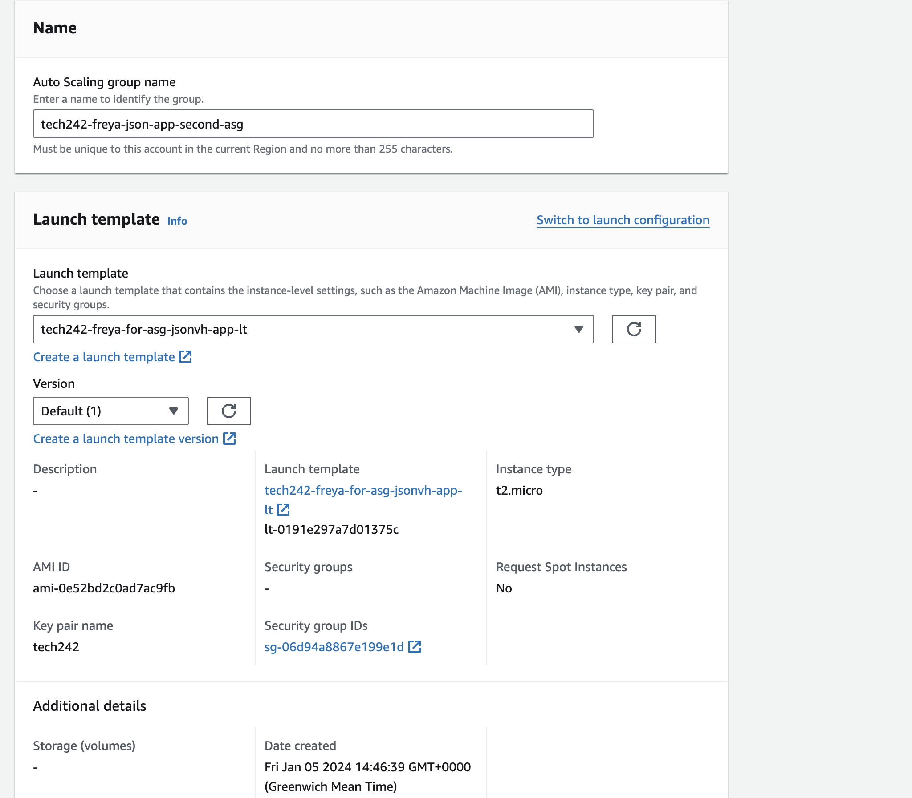
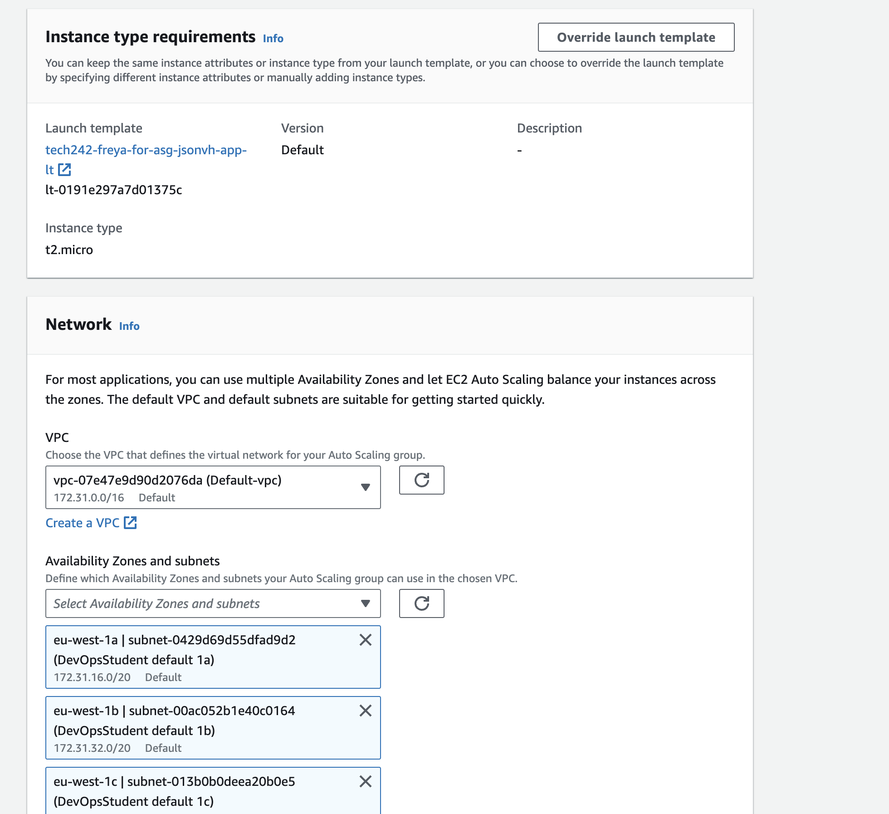
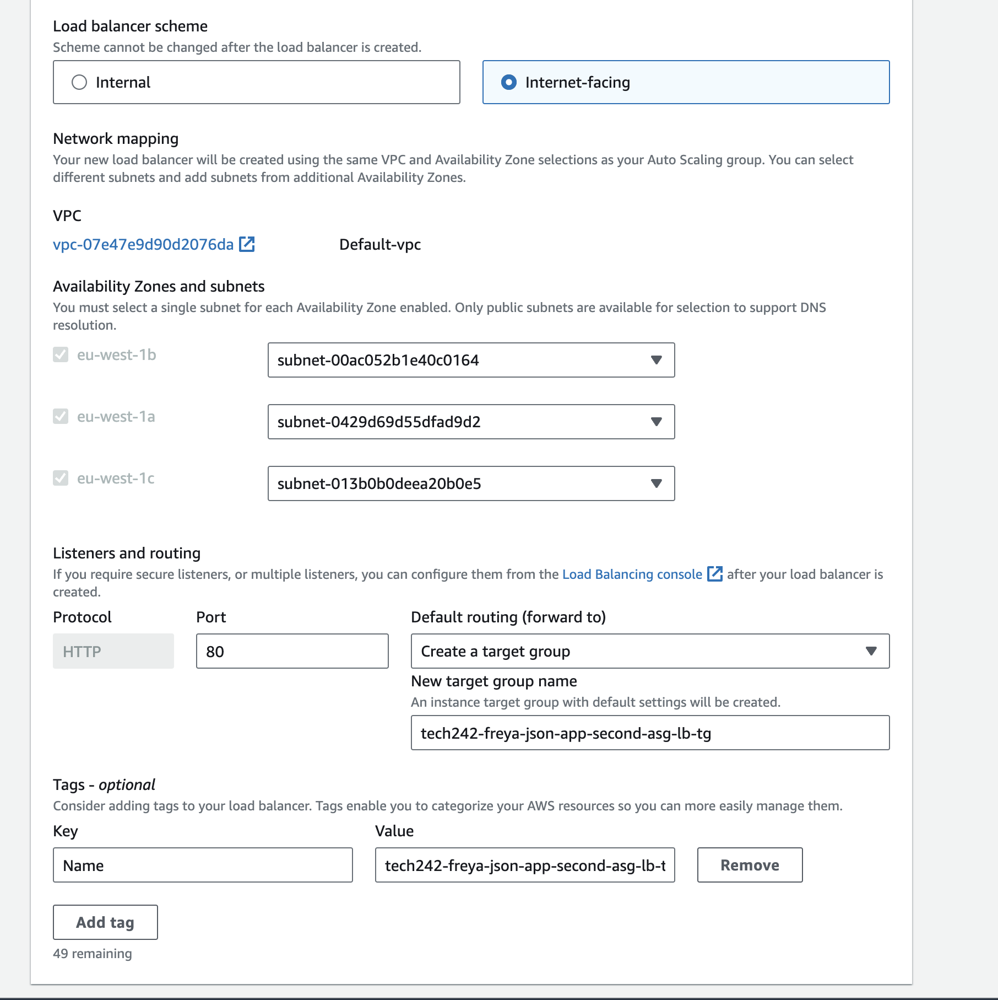
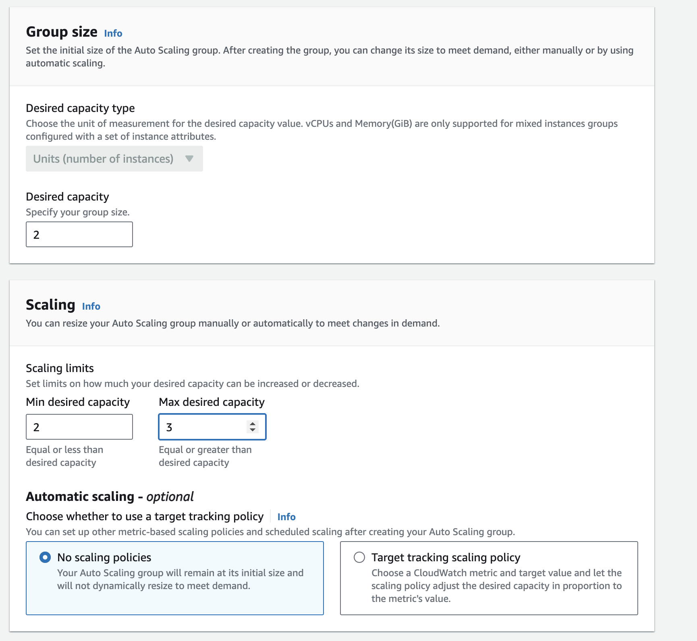

# Autoscaling Groups

We use autoscaling groups so we can handle varying CPU loads by scaling up and down or out or in, in the most efficient way possible (automatically).

## Scaling

Verical: Creates another VM that is larger and transfers the workload to it, then deletes the smaller one. 
    - up or down 
Horizontal: Creates multiple VM's as needed 
    - out or in

## Overview

Check at every step! 
1. VM
2. AMI
   1. a snapshot of the disc
3. Launch Template
   1. AMI + user data + security group + key pair
   2. everything needed to launch when autoscaling
4. Auto Scaling Group
   1. Also needs a scaling policy(needs to know how to scale)
   2. e.g. average CPU % utilisation (across the machines), threshold it needs to hit, and the min, max VM's

Auto scaling groups create the VM's

The VM's are all in different subnets so they all are in different availibility zones, and so if one data centre crashes there are still others working. 
Spreads the vm's out between the subnets availabile. Therefore it creates both High availibility (HA) and scalibility (SC).

Load Balancer: decides which VM should get the requests based on which are healthy and how much load they have.

## Launch Template Steps

1. Launch Templates
2. Create Launch template
   1. name
   2. My AMI's, owned my me
   3. t2.micro
   4. key pair
   5. subnet: don't include
   6. Security group
   7. User data
3. Check Template
   1. Actions
   2. Launch instance from template
   3. Add name under resource tags
   4. Test app

## Auto Scaling Group Steps

1. Auto Scaling Group
2. Create Auto Scaling Group
   1. name
   2. launch template
   3. next
   

   4. network: 
      1. default VPC, 
      2. availibilty zones :DevOpsStudent default 1a-ic

   5. Load balancing
      1. new load balancer
      2. application load balancer
      3. name
      4. internet-facing
      5. HTTP Port 80
      6. create a new target group
      7. name
   

   6. Turn on Elastic Load Balancing health checks (checks if instances are healthy or not so they can be replaced)
   7. health check period (waits for it to initialise)
   8. next
   9.  Desired, min and max

   1.  Target tracking scaling policy
   2.  Metric: average CPU
   3.  Target: 50
   4.  Maintenance Policy: Prioritize availibility
   5.  Tag: Name (for created instances)
   6.  Complete
   7.  You can now load the web from the load balancer DNS name

## Terminating

If you terminate one of the instances it will quickly spin another one up to replace it, but if you refresh the app it will be weird for a bit (100% availibility is not realistic as somethung will always go wrong somewhere)

To remove the instances for good you have to remove...
1. load balancer
2. target group
3. Auto Scaling Group

TMAY and then cover a technical area on course by was of a presentation

e.g. HA and SC with auto scaling groups 
    - enough to talk about 
    - to explain what YOU have done, how, and the benefits I saw from doing it that way and how they would apply in a bussiness context 
    - Keep it simple, diagrams as many people watching aren't technical