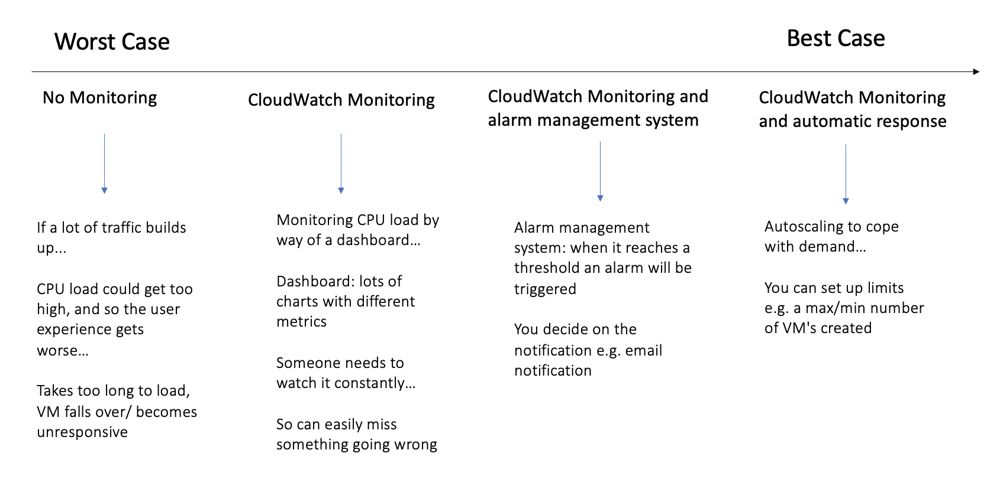
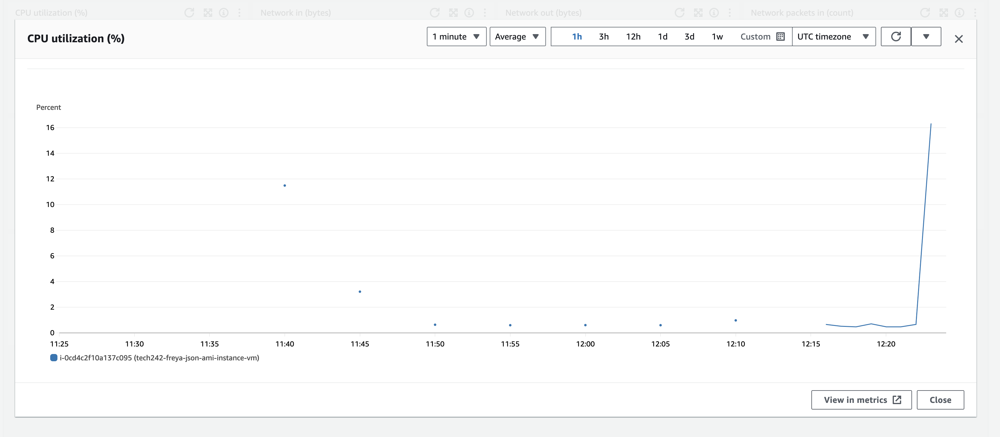

# Monitoring and Alert Management

Metric = a specific aspect that can be monitored e.g. cpu load.

Load testing = a method to work out the threshold where things start to become a problem with cpu load

## Monitoring Dashboard Steps

1. Go to working instance and the monitoring tab

2. Manage detailed monitoring, enable (shows 1 min period rather than 5 mins)
3. Add to dashboard
4. Create new, name, create, add to dashboard
5. expand CPU monitoring, change from 5 minutes to 1 minute, and x axis to 1hr

   
