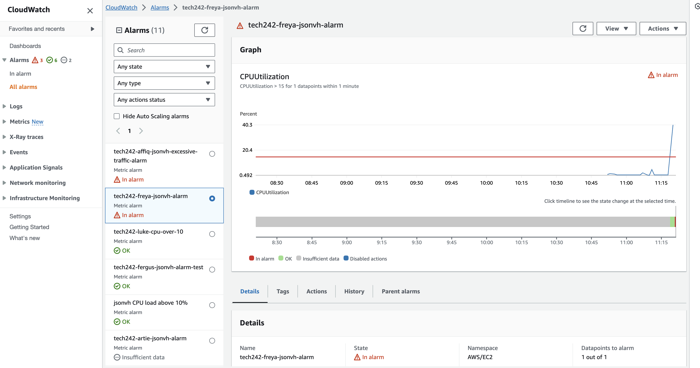
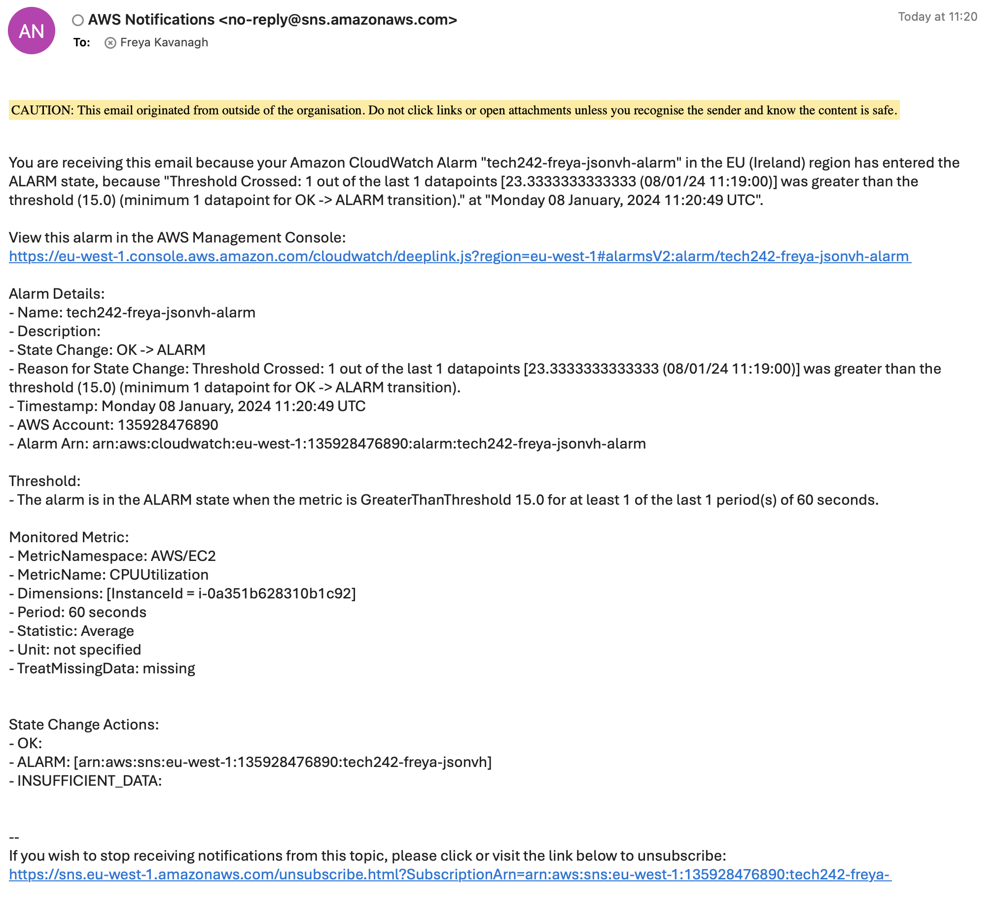

# Monitoring and Alert Management

Metric = a specific aspect that can be monitored e.g. cpu load.

Load testing = a method to work out the threshold where things start to become a problem with cpu load

## Monitoring Dashboard Steps

1. Go to working instance and the monitoring tab

2. Manage detailed monitoring, enable (shows 1 min period rather than 5 mins)
3. Add to dashboard
4. Create new, name, create, add to dashboard
5. expand CPU monitoring, change from 5 minutes to 1 minute, and x axis to 1hr

## Alarm Steps

1. set up vm and dashboard
2. Open the CloudWatch console at https://console.aws.amazon.com/cloudwatch/.
3. In the navigation pane, choose Alarms, All Alarms.
4. Choose Create alarm.
5. Change localtion to Ireland.
6. Choose Select metric.
7. In the All metrics tab choose EC2 metrics.
8. Choose Per-Instance Metrics.
9. Find the row with the instance that you want listed in the InstanceId column and CPUUtilization in the Metric Name column. 
10. Under Specify metric and conditions, for Statistic choose Average, choose one of the predefined percentiles, or specify a custom percentile (for example, p95.45)
11. Choose a period: 1 minute.
12. Under Conditions, specify the following: For Threshold type, choose Static. 
13. For Whenever CPUUtilization is, specify Greater. Under than..., specify the threshold that is to trigger the alarm to go to ALARM state if the CPU utilization exceeds this percentage e.g. 15
14. Choose Additional configuration. For Datapoints to alarm, specify how many evaluation periods (data points) must be in the ALARM state to trigger the alarm e.g. 1
15. Choose Next.
16. Under Notification, choose In alarm and select an SNS topic to notify when the alarm is in ALARM state. e.g. sparta email
17. When finished, choose Next.
18. Enter a name and description for the alarm. Then choose Next.
19. Under Preview and create, confirm that the information and conditions are what you want, then choose Create 

### Alarm Page...

### When the CPU load exceeds the percentage an email like this one will arrive...

