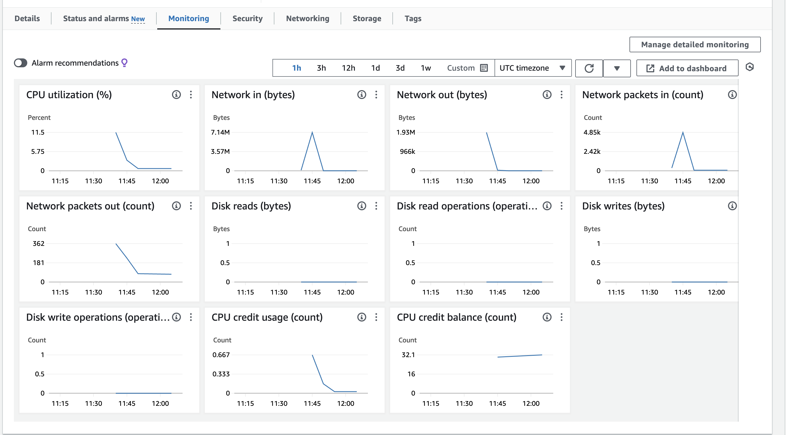

# Monitoring and Alert Management

Monitoring options...

- worst case = no monitoring
  - if a lot of traffic builds up...
  - cpu load gets too high and so user experience gets worse (takes too long to load, or even vm falls over/ becomes unresponsive)
- mid case = cloudwatch monitoring (CPU load)
  - monitoring cpu load by way of a dashboard
  - dashboard: lots of charts with different metrics
    - needs someone to watch it the whole time
    - easily miss something going wrong
- upper mid case = cloudwatch monitoring (CPU load) and alarm management system
  - alarm management system: when it reaches a threshold an alarm will be triggered
  - you decide notification e.g. email notification
- best case = cloudwatch monitoring (CPU load) and automatic response
  - Autoscaling to cope with demand (can set up limits e.g. a max/min number of vm's created)

Metric = a specific aspect that can be monitored e.g. cpu load.

Load testing = a method to work out the threshold where things start to become a problem with cpu load

## Monitoring Dashboard Steps

1. Go to working instance and the monitoring tab

2. Manage detailed monitoring, enable (shows 1 min period rather than 5 mins)
3. Add to dashboard
4. Create new, name, create, add to dashboard
5. expand CPU monitoring, change from 5 minutes to 1 minute, and x axis to 1hr

   
