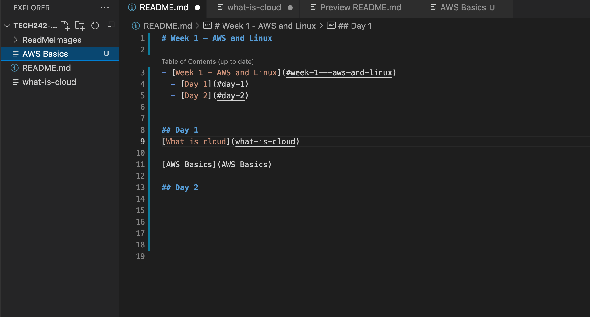

# Week 1 - AWS and Linux

- [Week 1 - AWS and Linux](#week-1---aws-and-linux)
  - [Day 1](#day-1)
  - [Day 2](#day-2)
  - [Code snipits](#code-snipits)
- [Credentials for a good interview](#credentials-for-a-good-interview)
- [Showing an Image](#showing-an-image)


## Day 1
[What is cloud?](what-is-cloud/README.md)
<br>
[AWS Basics](aws-basics/README.md)
<br>


## Day 2
[Linux](Linux/README.md)<br>
[EC2](ec2-instance/README.md)


## Code snipits

Change directory using this command: `cd <directory>`


```
cd <directory>
 ```

# Credentials for a good interview

- Condidence
- Answering the question that was asked
- Talking through your thought processes 
- Be honest if you don't know but try to talk around the question
- Structure your answers in a way that makes sense
- Body language
- Stay positive
- Be consice
- Use formal language
- Know your audience - laymans terms


# Showing an Image




