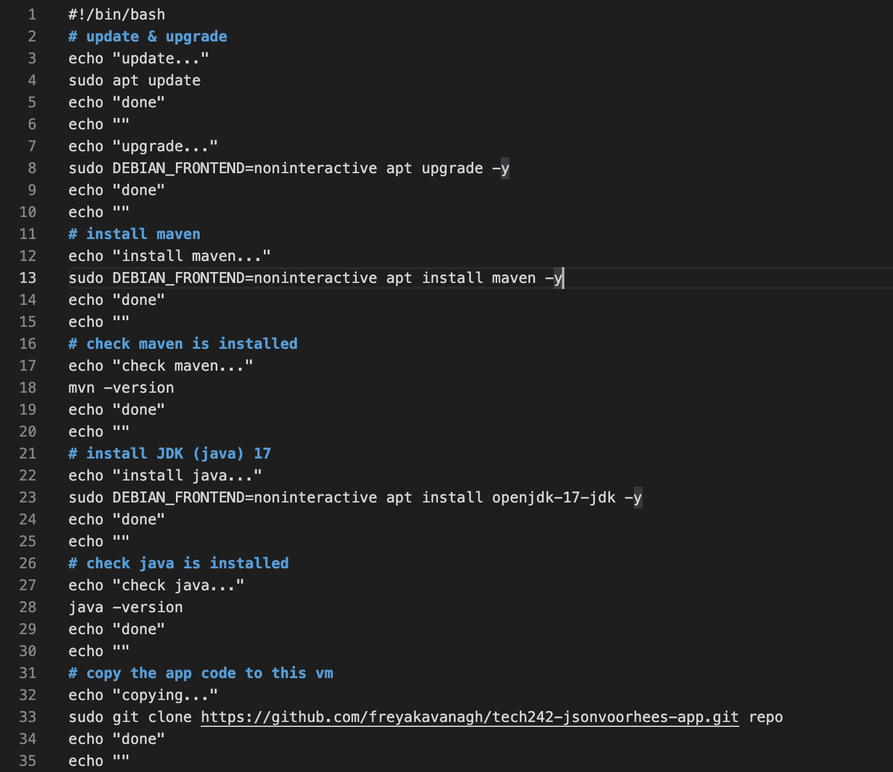
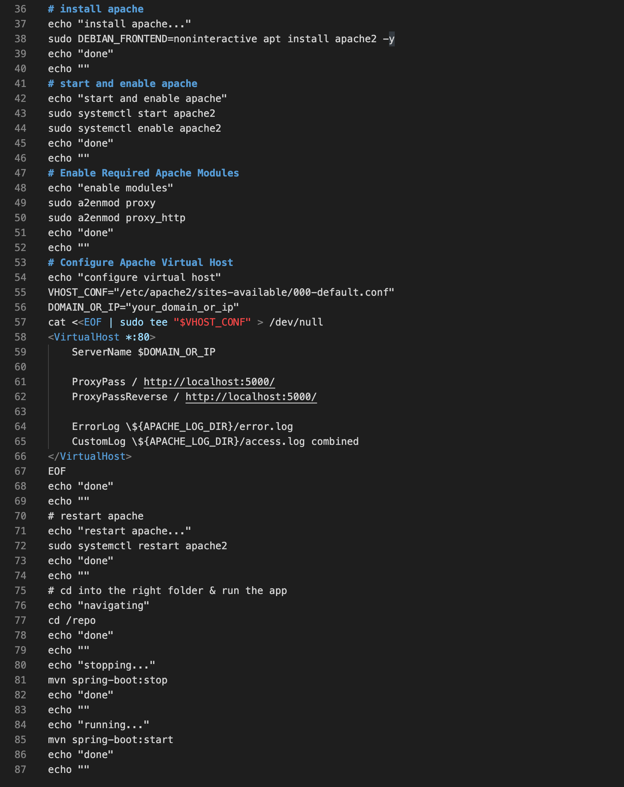

# Apache Reverse Proxy

Allows us to reach the website with just the ip address, by taking you automatically to the correct port.

1. Test commands manually on vm with basic script in user data
   - install apache
   - start and enable apache
   - Enable Required Apache Modules
   - Configure Apache Virtual Host (nano into file and edit)
   - restart apache
   - Test if you can access with only your ip address
2. Automate by adding commands to your original script and test on a fresh vm
   - add commands after the intalling java commands
   - test on a fresh vm
3. Automate in user data
   - Add script to user data and launch fresh instance
4. Automate with an ami
   - make an ami of the user data instance whilst it is running
   - WAIT for smi to finish being created
   - Stop user data instance
   - make an instance of your ami
   - test web access

# Apache script example

