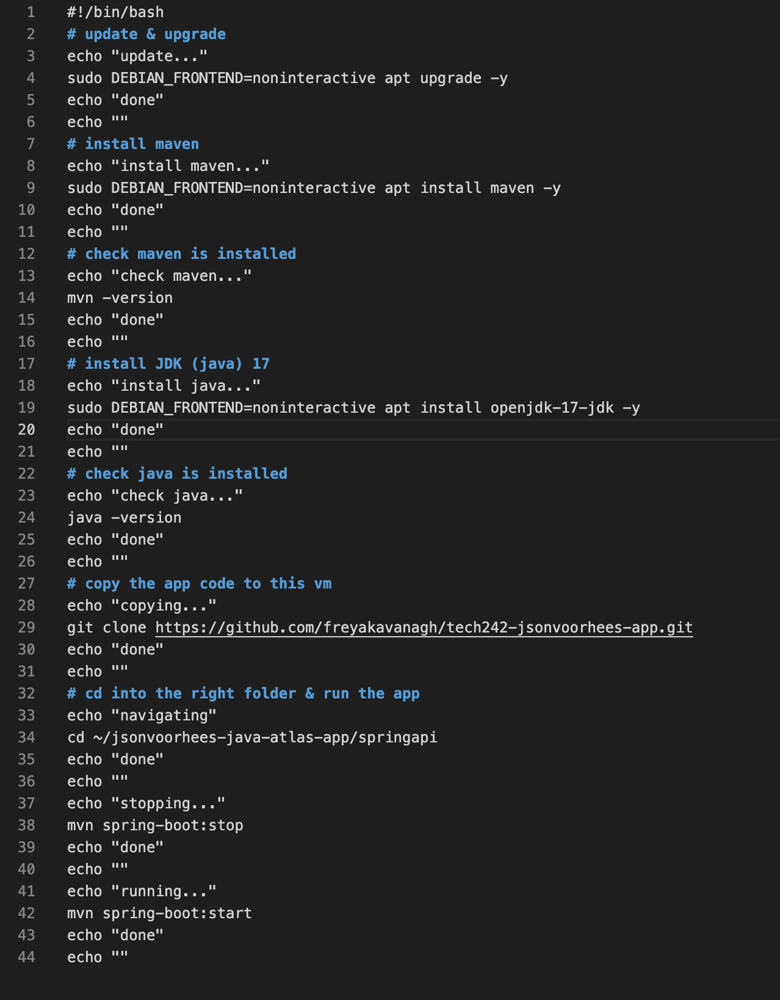

# Deployment of a java App

1. Plan
2. Test manualy
3. Note any issues<br>
e.g. user interaction

Update: ```sudo apt update```

Upgrade: ```sudo DEBIAN_FRONTEND=noninteractive apt upgrade -y```

Install dependencies:

maven: ```sudo DEBIAN_FRONTEND=noninteractive apt install maven -y```<br>
```mvn -version``` (checks maven is installed)

JDK 17:```sudo DEBIAN_FRONTEND=noninteractive apt install openjdk-17-jdk -y```<br>
```java -version``` (checks java is installed)

copy code to vm: ```git clone https://github.com/freyakavanagh/tech242-jsonvoorhees-app.git```

cd into the folder and run: 

```cd ~/jsonvoorhees-java-atlas-app/springapi```

```mvn spring-boot:stop```

```mvn spring-boot:start```

# Stop user interaction

```DEBIAN_FRONTEND=noninteractive``` 

# Copying from local to virtual

To get folder path: option and right click, copy as path

<u>For a file...</u>

```scp -i path/to/.pem /path/to/local/file username@publicIP:/path/on/vm```

scp -i ~/.ssh/tech242.pem ~/Desktop/testing.txt ubuntu@34.251.118.193:~

<u>For a folder...</u>

```scp -i path/to/.pem /path/to/local/file username@publicIP:/path/on/vm```

scp -r -i ~/.ssh/tech242.pem ~/Desktop/testfolder ubuntu@34.251.118.193:~

# Running a spring boot application

```cd ~/jsonvoorhees-java-atlas-app/springapi``` : move into the api folder

```mvn spring-boot:run``` : run the programme

```mvn spring-boot:start``` : runs the programme without engaging the terminal

```mvn spring-boot:stop``` : stops the programme from running

<u>In a web browser...</u>

http://34.251.118.193:5000/

http://34.251.118.193:5000/web/home

# Script Example


