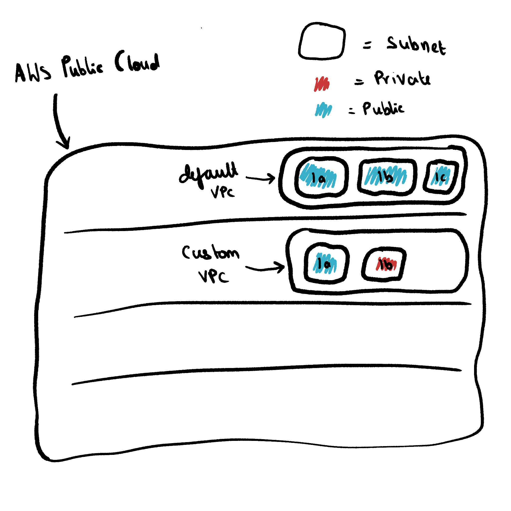
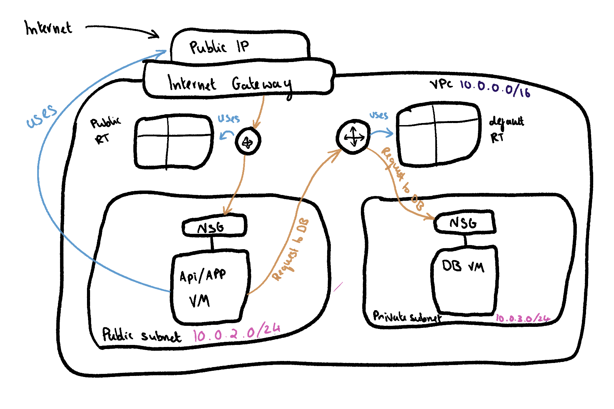

# AWS VPC's

A virtual Private Cloud/ Azure Virtual Network.

- A default VPC is created in every region (e.g. for Sparta in Ireland).
- Within the VPC there are three public subnets each one with a different availibility zone (1a,1b, or 1c)
- VM's can be put in any of the subnets.
  - Having different subnets is useful, as if one goes down there are others you can use.
- Having one shared VPC with public subnets can cause issues with security
  
## Custom VPC

- You can create your own VPC and decide which subnets are public and which are private and the availibility zones associated with them.
    - app vm in public
    - database vm in private

Version 4 IP Address
- e.g. 10.0.0.0
- each number can range from 0-255
- each number is 8 bits

CDIR Block (10.0.0.0/16)
- The VPC and subnets all have one
- Made up of a version 4 IP address and a number that denotes whihc bits are fixed
  - i.e if 16, the first two numbers of the IP are fixed
  - The subnets within the VPC can then share a part of the IP (the first two numbers)
    - if 10.0.2.0/24 was then assigned to a subnet, devices within the subnet will share the first three numbers of the IP

## Two Tier Example

VPC: 10.0.0.0/16

public subnet: 
-  10.0.2.0/24
-  1a
-  contains the app/api vm
private subnet
- 10.0.3.0/24
- 1b
- contains the database vm

Default Router: The default router uses a route table to look up where it can send packets in the network (safe traffic)
 - only allows routing within your VPC as everything is private unless you make it public
     - Internet gateway: like the VPC door
      
Internet Gateway: Like the door to the VPC

Custom Router: To allow for connections outside the VPC i.e. the internet (unsafe traffic)
- needed for commands e.g. update, upgrade, install
- need to make a public route table that looks up how to go from the inside to the outside and vice versa through the internet gateway
- private subnet can't use it so must be made from an AMI

## Steps:

1. Create the VPC
2. Create the subnets
3. Create the Internet Gateway
   - attatch it to the VPC
4. Create the public route table
   -  associate the route table with the subnet
   -  associate the route table with the internet gateway
      -  0.0.0.0/0
      -  Internet gateway
5. Check the setup of the VPC
   - diagram 
6. Create DB VM
   - ssh, my IP 
   - MYSQL/Aurora, 0.0.0.0/0 (security group)
7. Create App VM
   - ssh, my IP  
   - HTTP, anywhere

What is a VPC?
Screenshots!