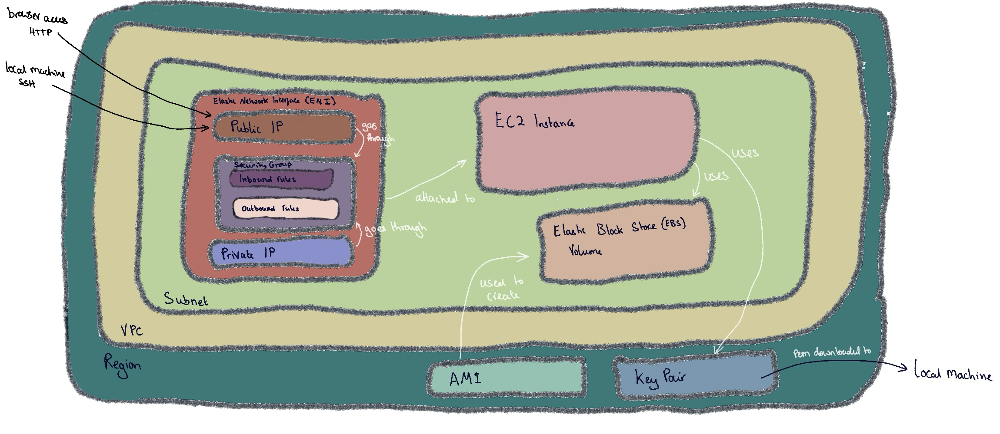

# EC2 Instance

EC2 instance is a virtual machine on AWS.

# Made up of...

Region: Where everything lives 
VPC Virtual Private Cloud(determines Region): like an appartment 
Subnet:like a room inside a house 
Elastic Network Interface:communicate with the computer through this 
Private IP: secret address 
Security group: like a security guard. Controlls any type of traffic coming in and out. e.g. which IP's can enter. Easily trasnferable to different VM's. 
Inbound rules: rules what is allowed in 
Outbound rules: rules what is allowed  
Public IP: your public address 
Elastic Block Store(EBS) Volume: stores the files 
EC2 Instance: like a computer/device within a room. 
Key pair: like a padlock on the computer 
AMI: the files you want to start off with. 

# IP's

- public ip: use most of the time
- private ip: use if two things within the same network

# Creating a Virtual Machine

1. Change to Ireland 
2. EC2 
3. Instances 
4. Launch Instance 

<u>Details to fill in...</u>

Name: tech242-freya-

AMI/Image: 
- Ubuntu - type of linux 
- filter for 20230424 
- ubuntu/images/hvm-ssd/ubuntu-bionic-18.04-amd64-server-20230424 
- ID: ami-0a7493ba2bc35c1e9

Instance type: t2.micro

key pair: tech242

Network Settings: 
- Create security group 
- Allow SSH traffic from myip (IP address changes if you turn off/ reset your router) 
- Allow HTTP traffic from the internet 
- tech242-freya-allow-SHH-my-IP-HTTP

## If IP Changes

1. EC2 
2. Instances 
3. Select Instance 
4. Security 
5. Security group link 
6. Inboumd rules 
7. Change to MyIP 
8. Save 

## Key Pair

1. Add .pem file to .ssh 
2. Command shift fullstop to see hidden files (.ssh) 
3. ls -a to see hidden files in terminal

## In Terminal
In .ssh 
chmod 400 name.pem 
log in: ssh -i "~/.ssh/name.pem" ubuntu@ec2-54-154-249-138.eu-west-1.compute.amazonaws.com 
yes 

# .SSH into EC2

In terminal
log in: ssh -i "~/.ssh/name.pem" ubuntu@ec2-54-154-249-138.eu-west-1.compute.amazonaws.com 
yes 
log out: exit

