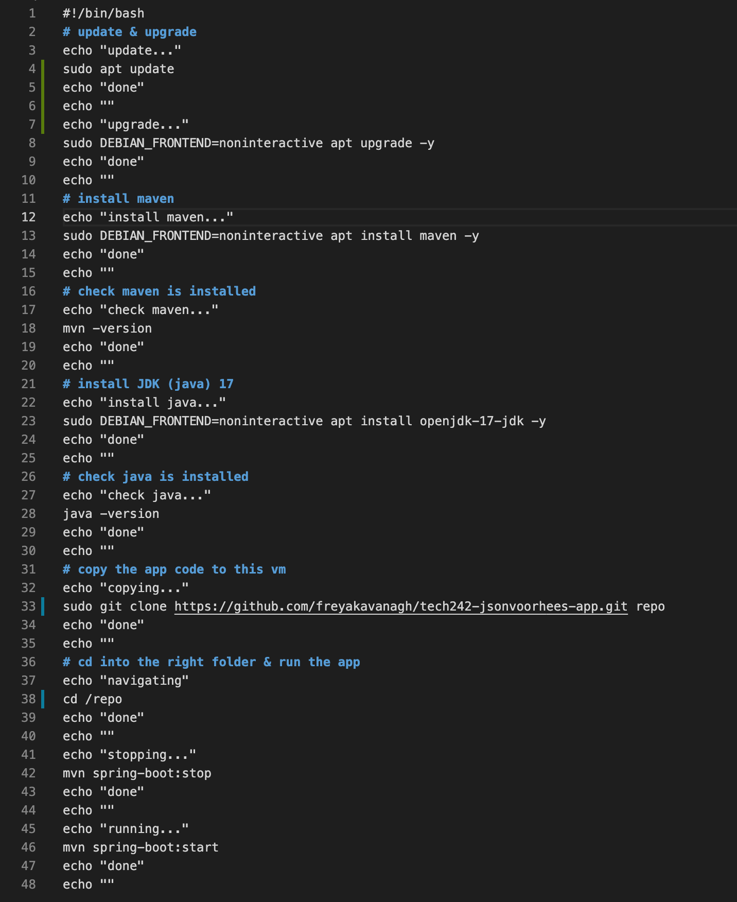

# Levels of Automation

1. Test commands manualy (ssh in)
2. Script (ssh in)
3. User data (a place in the advanced settings of an EC2 instance)


# User data

- Contains your script file (copy and paste)
- Runs as root user (therefore every command has superuser permissions)
  - Therefore doesn't need sudo in front of commands
- Starts in root directory
  - Therefore specify a folder to put it in when cloning (e.g. repo)
  - /repo
  - User data only runs once
    - Therefore always fresh vm
  - Only use once you've tested on a fresh VM

# User Data Script

When testing in root add sudo to commands and change permissions to give all permissions to everyone...

```sudo chmod 777 my-script.sh```

# User Data Script

