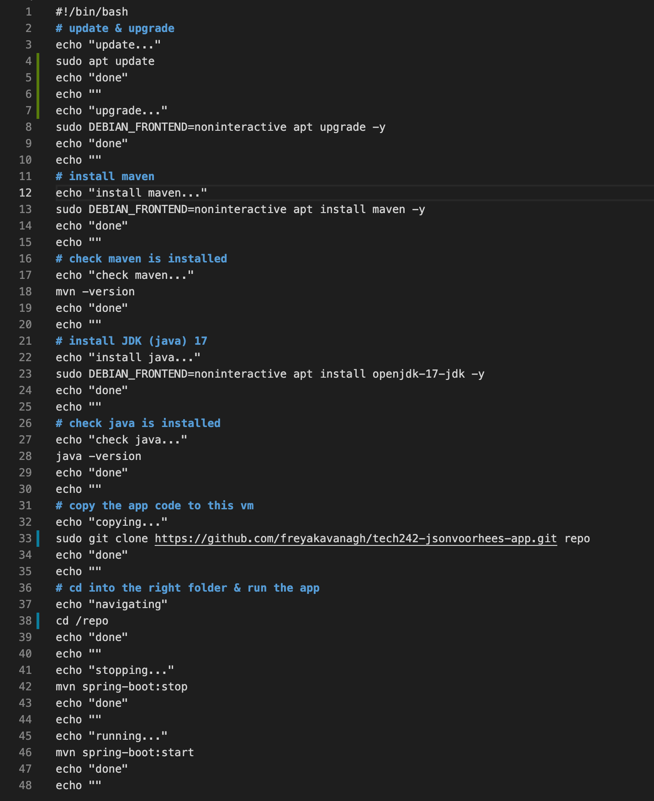

# User data

- Contains your script file (copy and paste)
- Runs as the root user (therefore every command has superuser permissions)
  - Therefore doesn't need sudo in front of commands
- Starts in root directory
  - Therefore specify a folder to put it in when cloning (e.g. repo)
  - /repo
- User data only runs once
    - Therefore always use a fresh vm to test each time
- Only use once you've tested on a fresh VM

## User Data Script

1. Edit the script to be able to run in the root
   - sudo the git clone command
   - clone into a folder called repo
   -  cd into /repo
2. Test this new script in root of new VM
   - Add sudo to commands
   - Give all permissions to everyone...
     - ```sudo chmod 777 script.sh```
3. Now test the script in User Data of new VM
   - Wait for it to load after launching
   - Test the website


## Example

